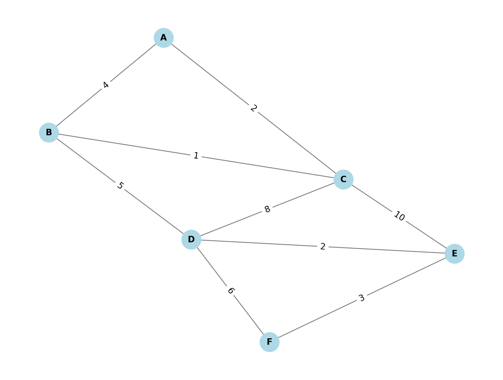

# Introduction

## General Definition of GSTAR (Generalized Space-Time Autoregressive) Model

The **Generalized Space-Time Autoregressive (GSTAR)** model is a statistical method used to model and forecast spatial and temporal dependencies simultaneously. It is widely applied to data that exhibits both time-dependent and location-dependent structures, such as geospatial datasets. The GSTAR model extends traditional autoregressive (AR) models by incorporating spatial information through a spatial weighting matrix, which represents how observations at different locations are interconnected.

The model assumes that the value of a variable at a particular location and time is influenced not only by its past values at that location (temporal dependency) but also by the past values at neighboring locations (spatial dependency). These dependencies are captured through a weight matrix that defines the relationships between different locations.

### General Formula for GSTAR(p; q)

The GSTAR(p; q) model with temporal lag $p$ and spatial lag $q$ is generally expressed as:

$$
X_i(t) = \sum_{k=1}^{p} \phi_{i,i}(k) X_i(t-k) + \sum_{l=1}^{q} \sum_{j \neq i} w_{ij}^{(l)} \phi_{i,j}(l) X_j(t-l) + \epsilon_i(t)
$$

Where:
- $X_i(t)$ is the observed value at location $i$ and time $t$,
- $\phi_{i,i}(k)$ are the autoregressive coefficients for the temporal lags at location $i$,
- $\phi_{i,j}(l)$ are the coefficients representing spatial dependence between location $i$ and neighboring locations $j$,
- $w_{ij}^{(l)}$ are the spatial weights for the influence of location $j$ on location $i$,
- $\epsilon_i(t)$ is the random error at location $i$ and time $t$.

#### Important Concepts in GSTAR:

1. **Temporal Lag (p):** Defines how many past time points (lags) are considered when modeling the dependency of a variable at a specific location. For example, $p = 1$ means the model only looks at the previous time point.
2. **Spatial Lag (q):** Refers to the extent of spatial interactions or how many neighboring locations are included in the model. For example, $q = 1$ means the model only considers the first-order neighbors.

3. **Spatial Weight Matrix (W):** This matrix captures the spatial relationships between different locations. Each element of the matrix $w\_{ij}$ represents the influence of location $j$ on location $i$.

The GSTAR model is particularly useful in fields such as environmental monitoring, traffic management, and climate studies, where spatio-temporal interactions play a critical role in understanding the underlying processes.

### GSTAR(1;1) Model

- **Definition**: The GSTAR(1;1) model is a **Generalized Space-Time Autoregressive** model with first-order autoregression in both time and space. This means that it considers the relationship between observations at a given location and time with the previous observation from the same location and neighboring locations.
  
- **Formula**:
  
$$
X_i(t) = \phi_{i,i}(1) X_i(t-1) + \sum_{j \neq i} w_{ij} \phi_{i,j}(1) X_j(t-1) + \epsilon_i(t)
$$

  where:
  - $X_i(t)$ is the observation at location $i$ at time $t$,
  - $\phi_{i,i}(1)$ and $\phi_{i,j}(1)$ are the autoregressive coefficients,
  - $w_{ij}$ is the weight matrix capturing the spatial dependence between location $i$ and $j$,
  - $\epsilon_i(t)$ is the error term at location $i$ and time $t$.

- The model captures both temporal and spatial dependencies with only one lag in time and space. It is often used for its simplicity and parsimony, balancing model fit with interpretability.

### GSTAR(1;2) Model

- **Definition**: GSTAR(1;2) extends the GSTAR(1;1) model by including two spatial lags instead of one. This means that the model not only considers the first-order neighbors but also includes second-order neighbors (i.e., locations two steps away in space).
  
- **Formula**:

$$
X_i(t) = \phi_{i,i}(1) X_i(t-1) + \sum_{j \neq i} w_{ij}^{(1)} \phi_{i,j}(1) X_j(t-1) + \sum_{k \neq i} w_{ik}^{(2)} \phi_{i,k}(2) X_k(t-1) + \epsilon_i(t)
$$

  where:
  - $w_{ik}^{(2)}$ represents the weight for the second-order neighbors.

- This model adds complexity by considering second-order spatial dependencies, which may better capture broader spatial patterns but also introduces more parameters to estimate. It is useful in datasets where distant locations influence each other indirectly.

---

### GSTAR(2;1,1) Model

- **Definition**: GSTAR(2;1,1) is a higher-order GSTAR model that includes two temporal lags and one spatial lag. This model accounts for observations at two previous time points and spatial neighbors from one step away.
  
- **Formula**:

$$
X_i(t) = \phi_{i,i}(1) X_i(t-1) + \phi_{i,i}(2) X_i(t-2) + \sum_{j \neq i} w_{ij} \phi_{i,j}(1) X_j(t-1) + \epsilon_i(t)
$$

  where:
  - $\phi_{i,i}(2)$ represents the second temporal lag.

- This model is more complex due to the addition of a second temporal lag, which allows it to capture longer-term temporal dependencies. It is useful in datasets with both short-term and long-term effects in space and time, but comes with the challenge of increased computational and estimation complexity.

#### Summary
- **GSTAR(1;1)**: Focuses on first-order temporal and spatial dependencies. It is simpler and easier to implement.
- **GSTAR(1;2)**: Adds second-order spatial dependencies, making it more suitable for datasets with indirect spatial effects.
- **GSTAR(2;1,1)**: Incorporates two temporal lags, capturing both short-term and long-term effects, but increases model complexity.

Each of these models balances between **complexity** and **forecasting accuracy**, depending on the spatial-temporal structure of the data.


---

## The Minimum Spanning Tree

### Introduction

A **spanning tree** of a graph is a subgraph that includes all the vertices of the original graph, is connected, and does not contain any cycles. The **Minimum Spanning Tree (MST)** is a spanning tree where the sum of the edge weights is minimized. MSTs are used to solve problems where we need to connect all points (or vertices) in the most efficient way.

### Definition

Given a connected, undirected graph $G = (V, E)$, where $V$ represents the vertices and $E$ represents the edges with associated weights, the objective is to find a subgraph that:

- Includes all vertices from $V$,
- Contains no cycles (i.e., it forms a tree),
- Minimizes the sum of the edge weights.

Let the weights of the edges be represented as $w: E \rightarrow \mathbb{R}$. The aim is to find the subgraph $T = (V, E_T)$, where $E_T \subseteq E$, such that:

$$
\sum_{(u, v) \in E_T} w(u, v)
$$

is minimized, subject to the condition that $T$ is a connected tree and contains all vertices of $G$.

### Properties of an MST

- **Acyclic**: An MST must not contain any cycles.
- **Connected**: The MST must connect all the vertices in the graph.
- **Minimal Weight**: The total sum of the edge weights in the MST is the smallest possible among all spanning trees.

### MST Algorithms

Several algorithms can be used to compute the MST of a graph. Two of the most popular are **Prim’s Algorithm** and **Kruskal’s Algorithm**. Both have different approaches but guarantee the same optimal solution.

#### Prim’s Algorithm

Prim’s algorithm grows the MST one edge at a time, starting from an arbitrary node and always choosing the edge with the minimum weight that connects a vertex inside the tree to a vertex outside the tree.

##### Steps
1. Start from any vertex.
2. Select the edge with the smallest weight that connects a vertex in the tree to one outside.
3. Repeat until all vertices are included in the tree.

#### Kruskal’s Algorithm

Kruskal’s algorithm sorts all the edges of the graph by weight and then adds them one by one to the MST, provided they do not form a cycle.

##### Steps
1. Sort all edges by increasing weight.
2. Initialize an empty forest (a set of trees).
3. For each edge, add it to the MST unless it forms a cycle.
4. Repeat until $V-1$ edges have been added.


### Example

Consider the graph below:

```
Vertices: {A, B, C, D, E, F}
Edges (with weights): 
(A, B) = 4, (A, C) = 2, (B, C) = 1, (B, D) = 5, (C, D) = 8, 
(C, E) = 10, (D, E) = 2, (D, F) = 6, (E, F) = 3
```


Using **Kruskal’s Algorithm**:

1. Sort the edges by weight: (B, C) = 1, (A, C) = 2, (D, E) = 2, (E, F) = 3, (A, B) = 4, (D, F) = 6, (B, D) = 5, (C, D) = 8, (C, E) = 10.
2. Add edges to the MST:
   - (B, C) = 1 (no cycle),
   - (A, C) = 2 (no cycle),
   - (D, E) = 2 (no cycle),
   - (E, F) = 3 (no cycle),
   - (A, B) = 4 (no cycle).
   
   The MST is formed after adding these edges.

The total weight of the MST is $1 + 2 + 2 + 3 + 4 = 12$.