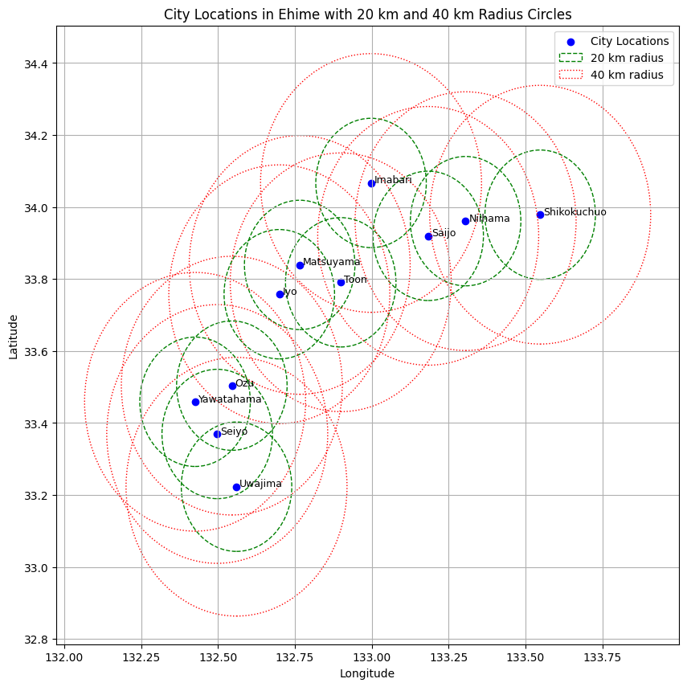
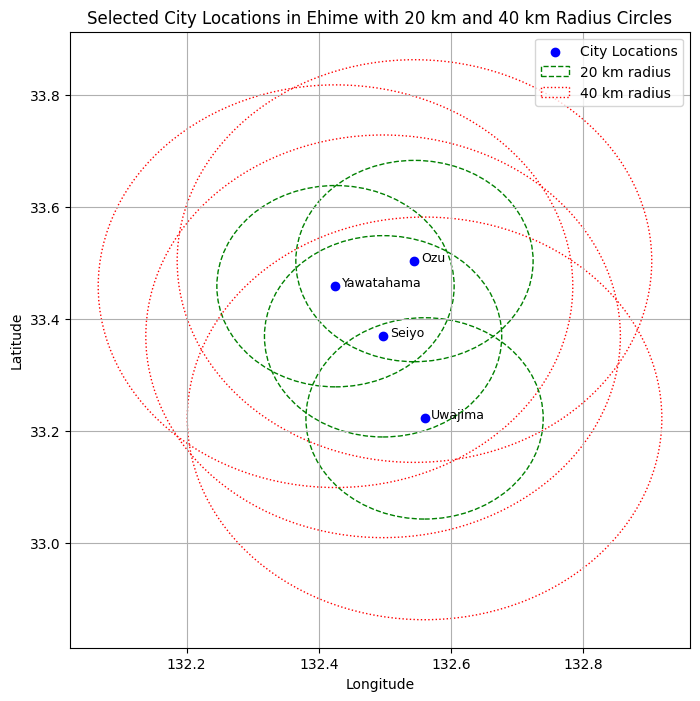

# GSTAR (Generalized Space-Time Autoregressive) Model

## Higher Order of GSTAR Model
### General Formula for GSTAR($p; \lambda_1,\lambda_2,\dots,\lambda_p$)
GSTAR($p; \lambda_1,\lambda_2,\dots,\lambda_p$) process is space-time process $\mathbf{Z}(t)$ which satisfies

$$
Z(t)=\sum_{k=1}^{p}\sum_{l=0}^{\lambda_k}\Phi_{kl}W^{(l)}Z(t-k)+\epsilon(t)
$$

where:
- $p$ : autoregressive order,
- $\lambda_k$ : spatial order of the $k$-th autoregressive term,
- $\mathbf{W}^{(l)} = (w_{ij}^{(l)})$ : $N\times N$ matrix of spatial weight for the spatial order $l$ which has zero diagonal, sum of each row is equal to one, and matrix $\mathbf{W}^{(0)}$ is defined as the identity matrix $\mathbf{I_N}$,
- $\Phi_{kl}$ : $N\times N$ diagonal parameter matrix of temporal lag $k$ and spatial lag $l$,
- $\mathbf{\epsilon}(t)$ : an error vector at time $t$ which is assumed to be independent normal with zero mean and constant variance.

## Examples
### GSTAR(2;1) Model

The GSTAR(2;1) model includes a temporal autoregressive order $p=2$ and a spatial order $\lambda_1=1$ for the first autoregressive term (at lag 1), but no spatial order for the second autoregressive term (at lag 2). The equation for this model can be written as:

$$
Z(t) = \sum_{k=1}^{2} \sum_{l=0}^{\lambda_k} \Phi_{kl} W^{(l)} Z(t-k) + \epsilon(t)
$$

In this case:
- For $k=1$, we have $\lambda_1=1$, so both spatial lags 0 and 1 are included.
- For $k=2$, we have $\lambda_2=0$, so only the spatial lag 0 (identity matrix) is considered.

Thus, the equation becomes:

$$
Z(t) = \Phi_{10} W^{(0)} Z(t-1) + \Phi_{11} W^{(1)} Z(t-1) + \Phi_{20} W^{(0)} Z(t-2) + \epsilon(t)
$$

<!-- where:
- $\Phi_{10}$ is a diagonal matrix of autoregressive parameters for temporal lag 1 and spatial lag 0.
- $\Phi_{11}$ is a diagonal matrix of autoregressive parameters for temporal lag 1 and spatial lag 1.
- $\Phi_{20}$ is a diagonal matrix of autoregressive parameters for temporal lag 2 and spatial lag 0.
- $W^{(0)}$ is the identity matrix, so it refers to self-influence at the previous time steps.
- $W^{(1)}$ is the spatial weight matrix for spatial lag 1. -->

### GSTAR(2;1,1) Model

The GSTAR(2;1,1) model includes a temporal autoregressive order $p=2$ and a spatial order $\lambda_1=1$ for the first autoregressive term and $\lambda_2=1$ for the second autoregressive term. In this case, both autoregressive terms involve spatial lags 0 and 1.

The equation for this model can be written as:

$$
Z(t) = \Phi_{10} W^{(0)} Z(t-1) + \Phi_{11} W^{(1)} Z(t-1) + \Phi_{20} W^{(0)} Z(t-2) + \Phi_{21} W^{(1)} Z(t-2) + \epsilon(t)
$$

<!-- where:
- $\Phi_{10}$ is a diagonal matrix of autoregressive parameters for temporal lag 1 and spatial lag 0.
- $\Phi_{11}$ is a diagonal matrix of autoregressive parameters for temporal lag 1 and spatial lag 1.
- $\Phi_{20}$ is a diagonal matrix of autoregressive parameters for temporal lag 2 and spatial lag 0.
- $\Phi_{21}$ is a diagonal matrix of autoregressive parameters for temporal lag 2 and spatial lag 1.
- $W^{(0)}$ is the identity matrix for spatial lag 0.
- $W^{(1)}$ is the spatial weight matrix for spatial lag 1. -->

---

### Python Code Simulation for GSTAR(2;1) and GSTAR(2;1,1)

Below are the code for simulating data generation of GSTAR(2;1) and GSTAR(2;1,1) models in Python.

#### GSTAR(2;1) Simulation:

```python
import numpy as np

# Parameters
N = 5  # Number of locations
T = 100  # Number of time points
p = 2  # Temporal autoregressive order
lambda_k1 = 1  # Spatial order for lag 1
lambda_k2 = 0  # Spatial order for lag 2

# Generate spatial weight matrix W^(1)
W1 = np.random.rand(N, N)
np.fill_diagonal(W1, 0)  # Ensure zero diagonal
W1 = W1 / W1.sum(axis=1, keepdims=True)  # Normalize rows

# Identity matrix for W^(0)
W0 = np.eye(N)

# Generate the diagonal parameter matrices
Phi_10 = np.diag(np.random.rand(N))
Phi_11 = np.diag(np.random.rand(N))
Phi_20 = np.diag(np.random.rand(N))

# Generate random noise epsilon
sigma = 0.1
epsilon = np.random.normal(0, sigma, (T, N))

# Initialize the Z process
Z = np.zeros((T, N))

# Initialize with random values for the first two time steps
Z[0, :] = np.random.rand(N)
Z[1, :] = np.random.rand(N)

# GSTAR(2;1) simulation
for t in range(2, T):
    Z[t, :] = (Phi_10 @ W0 @ Z[t-1, :] + Phi_11 @ W1 @ Z[t-1, :] + 
               Phi_20 @ W0 @ Z[t-2, :]) + epsilon[t, :]

# The Z matrix now holds the simulated space-time data for GSTAR(2;1)
```

#### GSTAR(2;1,1) Simulation:

```python
import numpy as np

# Parameters
N = 5  # Number of locations
T = 100  # Number of time points
p = 2  # Temporal autoregressive order
lambda_k1 = 1  # Spatial order for lag 1
lambda_k2 = 1  # Spatial order for lag 2

# Generate spatial weight matrix W^(1)
W1 = np.random.rand(N, N)
np.fill_diagonal(W1, 0)  # Ensure zero diagonal
W1 = W1 / W1.sum(axis=1, keepdims=True)  # Normalize rows

# Identity matrix for W^(0)
W0 = np.eye(N)

# Generate the diagonal parameter matrices
Phi_10 = np.diag(np.random.rand(N))
Phi_11 = np.diag(np.random.rand(N))
Phi_20 = np.diag(np.random.rand(N))
Phi_21 = np.diag(np.random.rand(N))

# Generate random noise epsilon
sigma = 0.1
epsilon = np.random.normal(0, sigma, (T, N))

# Initialize the Z process
Z = np.zeros((T, N))

# Initialize with random values for the first two time steps
Z[0, :] = np.random.rand(N)
Z[1, :] = np.random.rand(N)

# GSTAR(2;1,1) simulation
for t in range(2, T):
    Z[t, :] = (Phi_10 @ W0 @ Z[t-1, :] + Phi_11 @ W1 @ Z[t-1, :] + 
               Phi_20 @ W0 @ Z[t-2, :] + Phi_21 @ W1 @ Z[t-2, :]) + epsilon[t, :]

# The Z matrix now holds the simulated space-time data for GSTAR(2;1,1)
```
---
### Radius System for Clustering Region
#### Case: Cities in Ehime Prefecture
The **Radius System** for clustering regions involves grouping cities based on geographic proximity using a predefined radius. In this case, we apply the radius system to cities in Ehime Prefecture, using a radius of **20 km** to form clusters based on the distance between cities.

#### List of Cities in Ehime:
1. Matsuyama
2. Imabari
3. Uwajima
4. Niihama
5. Saijo
6. Ozu
7. Toon
8. Yawatahama
9. Seiyo
10. Shikokuchuo
11. Iyo

We can use the **geodesic distance** method from the **geopy** library to calculate the distance between the cities. This method computes the shortest path between two points on the surface of a sphere (which approximates Earth), taking into account the curvature of the Earth.

<!-- ### Why Geodesic Distance?
- **Accuracy**: The geodesic distance is more accurate than simpler calculations (like Euclidean distance) for geographic coordinates, as it accounts for the Earth's spherical shape.
- **Practical Use**: It’s commonly used for geographic and spatial analyses because it provides realistic distances over long ranges. -->

The formula I used is:
```python
from geopy.distance import geodesic

# Example for two cities
distance = geodesic((lat1, lon1), (lat2, lon2)).kilometers
```

In this code, `lat1, lon1` and `lat2, lon2` represent the latitude and longitude of two cities, and the `geodesic` function computes the distance between them in kilometers.

**Table 1: Distance Matrix for Cities in Ehime**
|             | Matsuyama | Imabari  | Uwajima  | Niihama  | Saijo    | Ozu     | Seiyo   | Shikokuchuo | Toon    | Iyo     | Yawatahama |
|-------------|-----------|----------|----------|----------|----------|---------|---------|-------------|---------|---------|------------|
| **Matsuyama**   | 0.00      | 33.14    | 70.95    | 51.71    | 39.69    | 42.45   | 57.73   | 73.98       | 13.47   | 10.91   | 52.67      |
| **Imabari**     | 33.14     | 0.00     | 102.01   | 30.75    | 23.67    | 75.21   | 90.17   | 51.74       | 31.93   | 44.00   | 85.77      |
| **Uwajima**     | 70.95     | 102.01   | 0.00     | 107.13   | 96.56    | 31.18   | 17.27   | 124.20      | 70.42   | 60.70   | 29.02      |
| **Niihama**     | 51.71     | 30.75    | 107.13   | 0.00     | 12.13    | 86.79   | 99.57   | 22.50       | 42.03   | 60.42   | 98.74      |
| **Saijo**       | 39.69     | 23.67    | 96.56    | 12.13    | 0.00     | 75.06   | 88.19   | 34.29       | 29.96   | 48.29   | 86.92      |
| **Ozu**         | 42.45     | 75.21    | 31.18    | 86.79    | 75.06    | 0.00    | 17.27   | 99.57       | 52.95   | 40.89   | 15.62      |
| **Seiyo**       | 57.73     | 90.17    | 17.27    | 99.57    | 88.19    | 17.27   | 0.00    | 112.46      | 68.61   | 56.24   | 22.57      |
| **Shikokuchuo** | 73.98     | 51.74    | 124.20   | 22.50    | 34.29    | 99.57   | 112.46  | 0.00        | 53.58   | 72.14   | 111.00     |
| **Toon**        | 13.47     | 31.93    | 70.42    | 42.03    | 29.96    | 52.95   | 68.61   | 53.58       | 0.00    | 21.77   | 62.16      |
| **Iyo**         | 10.91     | 44.00    | 60.70    | 60.42    | 48.29    | 40.89   | 56.24   | 72.14       | 21.77   | 0.00    | 51.45      |
| **Yawatahama**  | 52.67     | 85.77    | 29.02    | 98.74    | 86.92    | 15.62   | 22.57   | 111.00      | 62.16   | 51.45   | 0.00       |

We choose a radius $r=20$ km. This means any cities within 20 km of each other will belong to the same cluster.



Since analyzing all 11 cities may be too complex, we have simplified the model by selecting 4 representative cities—Ozu, Yawatahama, Seiyo, and Uwajima—to focus on their spatial relationships within the region.



**Table 2: Distance Matrix for Selected Cities in Ehime (Ozu, Yawatahama, Seiyo, Uwajima)**

|            | Ozu      | Yawatahama | Seiyo    | Uwajima  |
|------------|----------|------------|----------|----------|
| **Ozu**        | 0.00     | 12.18      | 15.54    | 31.18    |
| **Yawatahama** | 12.18    | 0.00       | 11.97    | 29.02    |
| **Seiyo**      | 15.54    | 11.97      | 0.00     | 17.27    |
| **Uwajima**    | 31.18    | 29.02      | 17.27    | 0.00     |

By using Inverse Distance Weight Matrix, we obtain two weight matrices as follows:

$$
\mathbf{W}^{(1)} = 
\begin{pmatrix}
0 & 0 & 0.56 & 0.44 \\
0.5 & 0 & 0.5 & 0 \\
0.31 & 0.41 & 0 & 0.28 \\
0 & 0 & 1 & 0
\end{pmatrix}
$$

$$
\mathbf{W}^{(2)} = 
\begin{pmatrix}
0 & 0 & 0 & 1 \\
0 & 0 & 0 & 1 \\
0 & 0 & 0 & 0 \\
0.48 & 0.52 & 0 & 0
\end{pmatrix}
$$

---
### Ordinary Least Square
The next step involves parameter estimation using the least squares method. To achieve this, we must reformulate the GSTAR model into a linear structure, expressed as:

$$
\mathbf{Y} = \mathbf{Z} \mathbf{\Phi} + \mathbf{e}
$$

To estimate the parameters $\mathbf{\Phi}$, we use the least squares estimator, which minimizes the sum of squared residuals $\mathbf{e} = \mathbf{Y} - \mathbf{Z} \mathbf{\Phi}$. The formula for the least squares estimator is:

$$
\hat{\mathbf{\Phi}} = (\mathbf{Z}' \mathbf{Z})^{-1} \mathbf{Z}' \mathbf{Y}
$$

where:
- $\hat{\mathbf{\Phi}}$ is the estimated parameter matrix.
- $\mathbf{Z}'$ is the transpose of the matrix $\mathbf{Z}$.
- $\mathbf{Z}' \mathbf{Z}$ is the product of the transposed design matrix and the design matrix, which must be invertible.
- $\mathbf{Z}' \mathbf{Y}$ is the product of the transposed design matrix and the observed data vector $\mathbf{Y}$.

This estimator provides the best linear unbiased estimate of the parameters under the assumption that the errors $\mathbf{e}$ are normally distributed with constant variance.