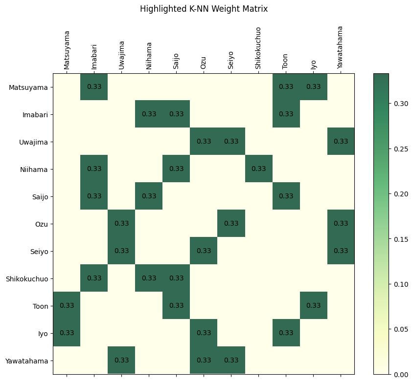

# Weight Matrix in GSTAR

## Definition
The weight matrix (“**W**”) in the Generalized Space-Time Autoregressive (GSTAR) model is a mathematical representation of spatial relationships between different locations. Mathematically, it can be viewed as a structured approach to quantifying the influence of one spatial unit on another, expressed through a matrix of coefficients. Each coefficient $w_{ij}$ represents the magnitude of influence that location $j$ exerts on location $i$.

In spatial statistics, the weight matrix enables the incorporation of spatial dependencies by assigning meaningful numerical weights based on factors such as closeness or connectivity. From a graph theory perspective, the weight matrix resembles an adjacency matrix, describing the edges (influence) between nodes (locations) in a spatial network. This dual perspective makes weight matrices both versatile and integral to spatial-temporal modeling like GSTAR.

### Characteristics:
- A square matrix with dimensions equal to the number of locations.
- Element $w_{ij}$ represents the weight of the influence of location $j$ on location $i$.
- Row-normalized such that $\sum_{j} w_{ij} = 1$, ensuring comparability.

---

## Importance of Weight Matrix
1. **Captures Spatial Dependencies:** Models how locations interact spatially over time, which is crucial in spatial-temporal analysis.
2. **Improves Model Precision:** Enhances predictive performance by incorporating spatial relationships, reducing residuals.
3. **Flexibility:** Can represent various spatial dynamics, including closeness, similarity, or specific influence.
4. **Scalability:** Adapts to large networks efficiently by limiting the number of interactions.

---

## Methods to Define Weight Matrix

### **K-Nearest Neighbors (K-NN):**
This method considers only the nearest $k$ neighbors for each location, making it suitable for capturing local spatial dependencies.

#### Weight Calculation:
Step-by-step:
1. **Compute Distance Matrix:** Calculate the geodesic distance between all pairs of locations to form a distance matrix. This can be achieved using several tools and algorithms, such as:
   - **Haversine Formula:** Computes the great-circle distance between two points on a sphere based on their latitude and longitude.
   - **Geopy Library (Python):** Automates distance calculations using geodesic or great-circle methods.
2. **Identify Nearest Neighbors:** For each location $i$:
   - Sort the distances to all other locations in ascending order.
   - Select the $k$ nearest neighbors (excluding $i$ itself).
3. **Assign Weights:**
   - Assign equal weights of $\frac{1}{k}$ to each of the $k$ nearest neighbors.
   - For non-neighbors, set the weight to 0.
4. **Normalize Rows (Optional):** Ensure that the sum of weights for each row equals 1.

#### Formula:
$$
    w_{ij} = \begin{cases}
    \frac{1}{k} & \text{if } j \text{ is among the k-nearest neighbors of } i, \\
    0 & \text{otherwise.}
    \end{cases}
$$

#### Example Calculation:
Consider 3 cities $A$, $B$, and $C$:
- Distances: $d_{AB} = 10$, $d_{AC} = 20$, $d_{BC} = 15$.
- $k = 1$: Each city connects to its single nearest neighbor.
  - For $A$: Nearest is $B$, so $w_{AB} = 1$, $w_{AC} = 0$.
  - For $B$: Nearest is $A$, so $w_{BA} = 1$, $w_{BC} = 0$.
  - For $C$: Nearest is $B$, so $w_{CB} = 1$, $w_{CA} = 0$.


There are some benefits of K-NN method, which are:
- Reflect direct relationships by focusing only on the closest neighbors.
- Reduces complexity by limiting connections.
- Simple to compute and interpret, particularly for small networks.

---

## Example: Weight Matrix for 11 Cities in Ehime

### Locations:
The 11 cities in Ehime are:
1. Matsuyama
2. Imabari
3. Uwajima
4. Niihama
5. Saijo
6. Ozu
7. Toon
8. Seiyo
9. Shikokuchuo
10. Yawatahama
11. Iyo

### Geodesic Distance Matrix (in km):
|               | Matsuyama | Imabari | Uwajima | Niihama | Saijo | Ozu   | Seiyo | Shikokuchuo | Toon  | Iyo   | Yawatahama |
|---------------|-----------|---------|---------|---------|-------|-------|-------|-------------|-------|-------|-------------|
| **Matsuyama** | 0.00      | 33.14   | 70.95   | 51.71   | 39.69 | 42.45 | 57.73 | 73.98       | 13.47 | 10.91 | 52.67       |
| **Imabari**   | 33.14     | 0.00    | 102.01  | 30.75   | 23.67 | 75.21 | 90.17 | 51.74       | 31.93 | 44.00 | 85.77       |
| **Uwajima**   | 70.95     | 102.01  | 0.00    | 107.13  | 96.56 | 31.18 | 17.27 | 124.20      | 70.42 | 60.70 | 29.02       |
| **Niihama**   | 51.71     | 30.75   | 107.13  | 0.00    | 12.13 | 86.79 | 99.57 | 22.50       | 42.03 | 60.42 | 98.74       |
| **Saijo**     | 39.69     | 23.67   | 96.56   | 12.13   | 0.00  | 75.06 | 88.19 | 34.29       | 29.96 | 48.29 | 86.92       |
| **Ozu**       | 42.45     | 75.21   | 31.18   | 86.79   | 75.06 | 0.00  | 41.00 | 121.00      | 20.00 | 49.00 | 29.00       |
| **Seiyo**     | 57.73     | 90.17   | 17.27   | 99.57   | 88.19 | 41.00 | 0.00  | 142.00      | 35.00 | 92.00 | 29.00       |
| **Shikokuchuo**| 73.98    | 51.74   | 124.20  | 22.50   | 34.29 | 121.00| 142.00| 0.00        | 133.00| 107.00| 98.00       |
| **Toon**      | 13.47     | 31.93   | 70.42   | 42.03   | 29.96 | 20.00 | 35.00 | 133.00      | 0.00  | 52.00 | 35.00       |
| **Iyo**       | 10.91     | 44.00   | 60.70   | 60.42   | 48.29 | 49.00 | 92.00 | 107.00      | 52.00 | 0.00  | 52.00       |
| **Yawatahama**| 52.67     | 85.77   | 29.02   | 98.74   | 86.92 | 29.00 | 29.00 | 98.00       | 35.00 | 52.00 | 0.00        |

---

### **K-NN Weight Matrix Example (k = 3):**

The choice of $k$ in K-NN significantly influences the weight matrix and, subsequently, the GSTAR model results. A smaller $k$ emphasizes local spatial dependencies, ensuring that each location interacts primarily with its closest neighbors. This can enhance model specificity but risks neglecting broader regional trends.

Conversely, a larger $k$ incorporates more distant neighbors, potentially capturing wider spatial influences. However, this may weaken local effects and introduce noise, especially if distant locations have weaker correlations.

We must carefully balance $k$ based on the study's objectives and the spatial characteristics of the dataset. RMSE, AIC, BIC, and other test can be done to check the optimal $k$. Here we present $k=3$ as follow:

```python
import pandas as pd
from geopy.distance import geodesic
import matplotlib.pyplot as plt

# Coordinates of Cities in Ehime
cities = {
    'Matsuyama': (33.839157, 132.765575),
    'Imabari': (34.066826, 132.997665),
    'Uwajima': (33.223044, 132.560234),
    'Niihama': (33.960793, 133.305234),
    'Saijo': (33.919939, 133.183518),
    'Ozu': (33.503867, 132.544953),
    'Seiyo': (33.369542, 132.497444),
    'Shikokuchuo': (33.978684, 133.547751),
    'Toon': (33.790904, 132.899109),
    'Iyo': (33.757796, 132.699346),
    'Yawatahama': (33.458984, 132.425369)
}

# Calculate geodesic distance matrix
city_names = list(cities.keys())
distance_matrix = pd.DataFrame(index=city_names, columns=city_names, dtype=float)

for city1 in city_names:
    for city2 in city_names:
        if city1 == city2:
            distance_matrix.loc[city1, city2] = 0
        else:
            distance_matrix.loc[city1, city2] = geodesic(cities[city1], cities[city2]).kilometers

# Generate K-NN weight matrix
def generate_knn_weight_matrix(distance_matrix, k):
    n = len(distance_matrix)
    weight_matrix = pd.DataFrame(0, index=distance_matrix.index, columns=distance_matrix.columns, dtype=float)

    for i in distance_matrix.index:
        distances = distance_matrix.loc[i].drop(i)
        nearest_neighbors = distances.nsmallest(k).index
        weight = 1 / k
        weight_matrix.loc[i, nearest_neighbors] = weight

    return weight_matrix

def highlight_nonzero(matrix):
    fig, ax = plt.subplots(figsize=(10, 8))
    cax = ax.matshow(matrix, cmap='YlGn', alpha=0.8)
    plt.colorbar(cax)

    # Annotate each cell with the corresponding weight
    for (i, j), val in np.ndenumerate(matrix.values):
        if val != 0:
            ax.text(j, i, f'{val:.2f}', ha='center', va='center', color='white')

    # Formatting the plot
    ax.set_xticks(range(len(matrix.columns)))
    ax.set_yticks(range(len(matrix.index)))
    ax.set_xticklabels(matrix.columns, rotation=90)
    ax.set_yticklabels(matrix.index)
    ax.set_title("Highlighted K-NN Weight Matrix", pad=20)
    plt.show()

# Apply function for k=5
k = 3
knn_weight_matrix = generate_knn_weight_matrix(distance_matrix, k)

# Display the K-NN weight matrix
print("K-NN Weight Matrix (k=3) for 11 Cities in Ehime:")
display(highlight_nonzero(knn_weight_matrix))
```

---

## Conclusion
The weight matrix is a critical component of GSTAR modeling, enabling it to account for spatial relationships effectively. Methods like K-NN provide a straightforward perspective on how locations influence one another based on closeness. By selecting the appropriate method and $k$, we can enhance model accuracy and interpretability. Additionally, using real-world examples such as Ehime’s cities highlights the practical application of spatial modeling in geographically diverse areas.

